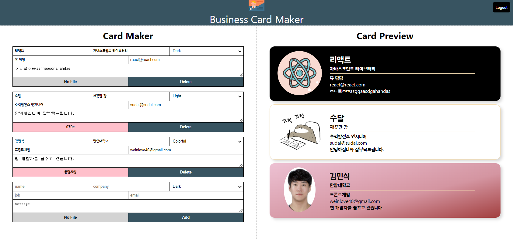
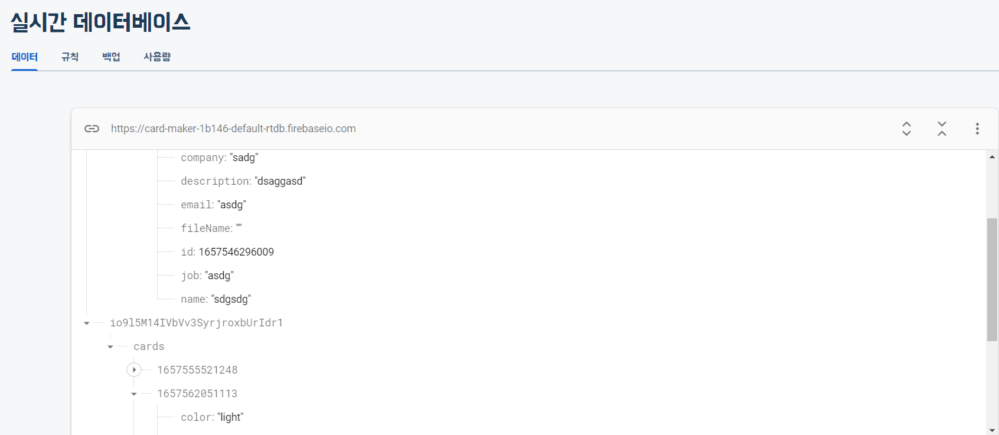
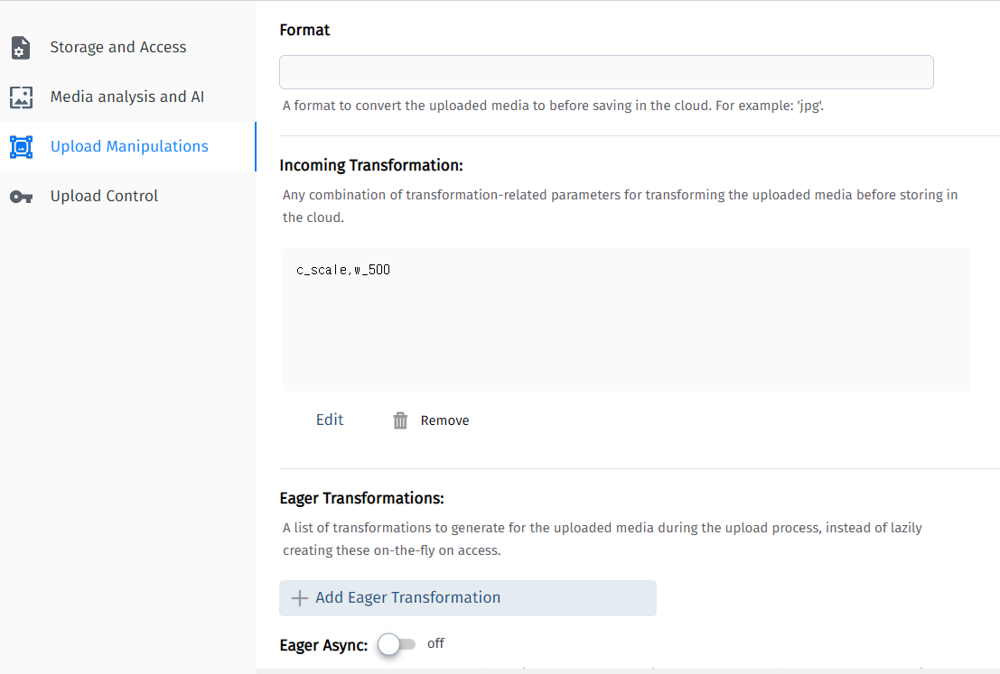
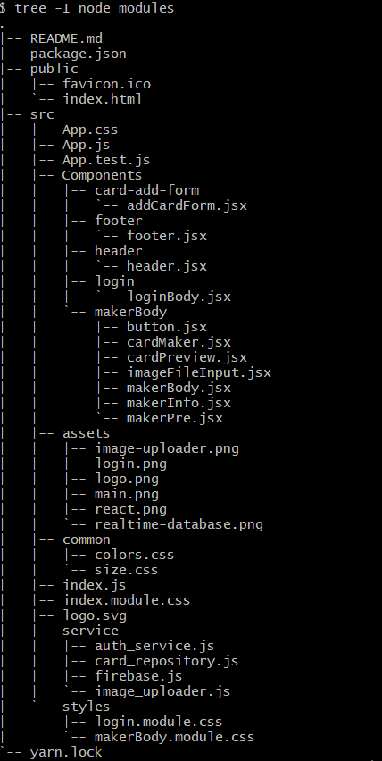

<h1># 리액트 프로젝트 세번째 연습</h1>
<h3>Msik Business Card Maker</h3>

🚀배포 링크 : https://msikbusinesscard.netlify.app/
<br>

<div style="display:flex">


</div>

##### 이번 프로젝트는 firebase의 realtime database기능과 Authentication기능을 사용하여 제작한 명함 만들기 어플입니다. firebase를 사용해보았고 여러가지로 업그레이드 된 내용이 많아서 검색하면서도 많은 어려움을 느꼈던 것 같습니다. 추가로 cloudinary라고 하는 이미지를 업로드 할 수 있는 서비스를 통해 사용자가 업로드 하고자 하는 image를 간편하게 이용할 수 있는 기술을 배울 수 있었습니다. firebase는 기능을 많이 사용하여 sdk를 설치하였고 cloudinary의 경우 사용하는 내용이 많지 않아서 일반 api code를 받아와서 사용하였습니다.

- firebase도 cloud storage기능으로 image업로드가 가능하지만 cloudinary는 이미지와 미디어 관련해서 크기를 조정하는 것과 같이 customize기능이 더욱 잘 되있어서 사용하였습니다.  

- SDK (software development kit) : 소프트웨어 개발 도구 모음이라고 볼 수 있습니다. 사용자가 어떻게 통신을 해야하는지 걱정하지 않아도 서비스에서 제공해주는 sdk를 라이브러리 처럼 프로젝트에 포함해놓으면(의존을 추가하면) 이를 통해 제공되는 함수를 사용해 내부적으로 통신을 수행하여 결과를 전달해줍니다. 다만 sdk 전부를 설치해야하기 때문에 의존하는 내용이 추가됨으로 효율적인지 생각하고 설치해야 합니다.

---

## 🙋‍♀️ 프로젝트 내용

### 1. login 페이지

- firebase Authentication OAUTH를 사용하였다. google과 github 사용을 설정하였고 이에 맞춰 구글과 github계정을 통해 팝업창이 나타나 로그인이 가능하도록 제작하였습니다. google의 경우 간편했지만 github의 경우 따로 github 계정 settings -> Developer settings -> OAuth apps에서 card maker프로젝트와 연결하기 위한 클라이언트 id, 보안 비밀번호를 받아서 사용해야 OAuth기능을 사용할 수 있었습니다.
  <br>

- 프로젝트에서는 service 폴더에 auth_service.js 모듈을 통해 클래스를 생성해 외부에서 인스턴스를 주입해주는 dependency injection방법으로 view를 담당하는 컴포넌트와 연결하였습니다..
  <br>

- REACT_APP_FIREBASE_API, AUTH_DOMAIN, DB_URL, PROJECT_ID와 같은 정보는 .env파일을 통해 외부의 노출을 막도록 제작하였습니다.

---

### 2. login 페이지 / main 페이지

- 로그인이 성공하면 main page로 넘어갈 수 있으며 이는 react-router-dom을 활용하였습니다.

특히 useNavigate와 useLocate의 쓰임을 정확히 공부할 수 있던 기회가 되서 좋은 시간이었습니다. useNavigate로 페이지를 이동하면서 전달할 정보를 함께 넘겨줄 수 있고 이후 넘어온 페이지에서 useLocate를 통해 정보가 존재하면 main화면이 나타나고 없다면 나타나지 않도록 구현하였습니다.

```
 const goToMaker = (userId) => {
    navigate("/home", {
      state: { id: userId },
    });
  };
```

```
      {location.state ? (
        <div className={styles.body}>
          <Header state={location.state} authService={authService} />
          <section className={styles.content}>
            <CardMaker
              information={information}
              setInformation={setInformation}
              FileInput={FileInput}
              cardRepository={cardRepository}
              userId={userId}
            />
            <CardPreview information={information} />
          </section>
          <Footer />
        </div>
      ) : (
        <p>로그인 후 이용해 주세요!</p>
      )}
```

---

### 3. login 정보 저장 및 realtime database 사용

- 만약 로그인 기록, 정보가 있다면 기존에 사용하던 내용을 그대로 가져올 수 있도록 useLocate로 가져온 state를 비교합니다. 이때 card_repository.js라는 모듈을 통해 의존성 주입 기능을 실현하였다.
  <br>

- saveCard, removeCard, syncCards함수들을 통해 각각 새로운 내용이면 작성하는 내용들을 새롭게 저장하고 삭제하면 database에서 삭제하며 로그인시 같은 정보의 id가 있다면 기존 정보를 가져와서 보여주도록 구현하였습니다.
  

---

### 4. main 페이지

- card maker와 card preview라는 2개의 ui를 통해 maker에서 입력한 정보를 토대로 preview를 통해 완성된 명함의 모습을 살펴볼 수 있습니다. 이 과정에서 input type='file'을 새로 배울 수 있었고 maker의 내용이 preview로 반영되는 과정에서 비동기적인 움직임이 생길 것을 고려해 세터함수에 콜백함수를 전달하여 순서를 보장하였습니다.

```
setItem((Info) => {
        const newFullInfo = { ...information };
        newFullInfo[id] = updateInfo;
        return newFullInfo;
      });
```

<br>

- maker에는 정보입력과 동시에 사용자의 image를 업로드 할 수 있도록 구현하였고 image_uploader.js라는 모듈을 통해 생성한 인스턴스를 주입하여 view에서 구현하였습니다.  
  <br>
- image_uploader.js파일 - 데이터를 전달하는 과정에서 cloudinary계정의 사용자 id가 url주소에 포함되어야 했습니다. 또 settings를 통해 설정 가능한 Upload presets에 로그인 하지 않아 모두가 이용할 수 있는 Unsigned api를 생성하여 data.append에 추가해주어야 했습니다.

```
class ImageUploader {
  async upload(file) {
    const data = new FormData();
    data.append("file", file);
    data.append("upload_preset", "xt86oyzp");
    const res = await fetch(
      "https://api.cloudinary.com/v1_1/dsfb2rjil/image/upload",
      {
        method: "POST",
        body: data,
      }
    );
    return await res.json();
  }
}

export default ImageUploader;
```

- cloudinary의 Upload Manipulations를 통해 업로드하고자 하는 이미지의 format, size 등 다양한 transformation이 가능합니다.
  

---

## 🛠기술 스택

<table>
  <tr height="130px">
    <td align="center" width="130px">
      </a>
    </td>
    <td align="center" width="130px">
      </a>
    </td>
    <td align="center" width="130px">
      </a>
    </td>
    <td align="center" width="130px">
      </a>
    </td>
  </tr>
</table>

## 📁프로젝트 구조

  

- 윈도우에서 트리 사용하기 참조: https://velog.io/@jeongjae96/Windows-Git-Bash%EC%97%90%EC%84%9C-tree-%EB%AA%85%EB%A0%B9%EC%96%B4-%EC%82%AC%EC%9A%A9%ED%95%98%EA%B8%B0
- tree 명령어에서 일부 제외하길 원할때 : https://m.blog.naver.com/foxez/221411283235


---

- 추가 학습 : 
1) firebase에서 netlify로 만들어진 도메인 주소의 authentication(승인된 도메인 주소)를 추가해야만 배포 사이트에서 firebase를 사용할  있었다.
2) netlify 첫 배포후 .env파일의 환경변수를 site settings -> build&deploy -> environment를 통해 다시 설정해주고 재 build를 실시하여 환경변수 정보를 가져올 수 있었다. 
